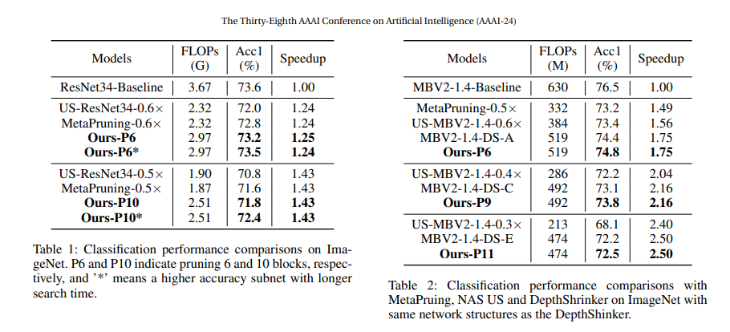

# UPDP-Pruner
Official Repo for AAAI2024 [UPDP](https://ojs.aaai.org/index.php/AAAI/article/view/29296)

## Framework

- **UPDP framework**

## Experiments

- **Pruned Results**

### Citation 
@inproceedings{liu2024updp,  
 &nbsp title={Updp: A unified progressive depth pruner for cnn and vision transformer},  
 &nbsp author={Liu, Ji and Tang, Dehua and Huang, Yuanxian and Zhang, Li and Zeng, Xiaocheng and Li, Dong and Lu, Mingjie and Peng, Jinzhang and Wang, Yu and Jiang, Fan and others},  
 &nbsp booktitle={Proceedings of the AAAI Conference on Artificial Intelligence},  
 &nbsp volume={38},  
 &nbsp number={12},  
 &nbsp pages={13891--13899},  
 &nbsp year={2024}  
}
