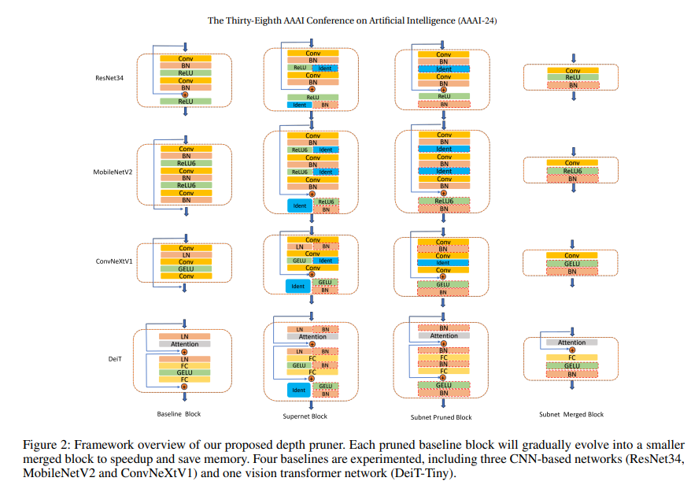

# UPDP-Pruner
Official Repo for AAAI 2024 UPDP[https://ojs.aaai.org/index.php/AAAI/article/view/29296]

## Framework

- **UPDP framework**

## Experiments

- **Pruned Results**

### Citation 
@inproceedings{liu2024updp,  
  title={Updp: A unified progressive depth pruner for cnn and vision transformer},  
  author={Liu, Ji and Tang, Dehua and Huang, Yuanxian and Zhang, Li and Zeng, Xiaocheng and Li, Dong and Lu, Mingjie and Peng, Jinzhang and Wang, Yu and Jiang, Fan and others},  
  booktitle={Proceedings of the AAAI Conference on Artificial Intelligence},  
  volume={38},  
  number={12},  
  pages={13891--13899},  
  year={2024}  
}
